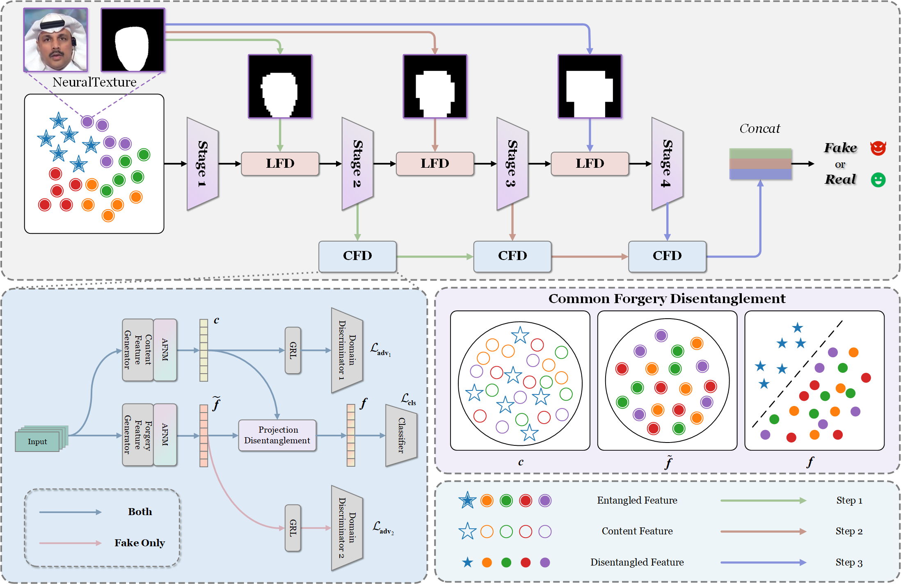

## ⏳ Dual Feature Progressive Disentanglement (DFPD_Net) Project



### 1. Installation
You can run the following script to configure the necessary environment:

  ```
  pip install -r requirements.txt
  ```

### 2. Download Data

🛡️ **Copyright of the above datasets belongs to their original providers.**


Other detailed information about the datasets used in DeepfakeBench is summarized below:


| Dataset | Real Videos | Fake Videos | Total Videos | Rights Cleared | Total Subjects | Synthesis Methods | Perturbations | Original Repository |
| --- | --- | --- | --- | --- | --- | --- | --- | --- |
| FaceForensics++ | 1000 | 4000 | 5000 | NO | N/A | 4 | 2 | [Hyper-link](https://github.com/ondyari/FaceForensics/tree/master/dataset) |
| FaceShifter | 1000 | 1000 | 2000 | NO | N/A | 1 | - | [Hyper-link](https://github.com/ondyari/FaceForensics/tree/master/dataset) |
| DeepfakeDetection | 363 | 3000 | 3363 | YES | 28 | 5 | - | [Hyper-link](https://github.com/ondyari/FaceForensics/tree/master/dataset) |
| CelebDF-v1 | 408 | 795 | 1203 | NO | N/A | 1 | - | [Hyper-link](https://github.com/yuezunli/celeb-deepfakeforensics/tree/master/Celeb-DF-v1) |
| CelebDF-v2 | 590 | 5639 | 6229 | NO | 59 | 1 | - | [Hyper-link](https://github.com/yuezunli/celeb-deepfakeforensics) |
| DeepForensics-1.0 | 50000 | 10000 | 60000 | YES | 100 | 1 | 7 | [Hyper-link](https://github.com/EndlessSora/DeeperForensics-1.0/tree/master/dataset) |
| UADFV | 49 | 49 | 98 | NO | 49 | 1 | - | [Hyper-link](https://docs.google.com/forms/d/e/1FAIpQLScKPoOv15TIZ9Mn0nGScIVgKRM9tFWOmjh9eHKx57Yp-XcnxA/viewform) |


Upon downloading the datasets, please ensure to store them in the [`./datasets`](./datasets/) folder, arranging them in accordance with the directory structure outlined below:

```
datasets
├── FaceForensics++
│   ├── original_sequences
│   │   ├── youtube
│   │   │   ├── c23
│   │   │   │   ├── videos
│   │   │   │   │   └── *.mp4
│   │   │   │   └── frames (if you download my processed data)
│   │   │   │   │   └── *.png
|   |   |   |   └── masks (if you download my processed data)
│   │   │   │   │   └── *.png
│   │   │   │   └── landmarks (if you download my processed data)
│   │   │   │   │   └── *.png
│   │   │   └── c40
│   │   │   │   ├── videos
│   │   │   │   │   └── *.mp4
│   │   │   │   └── frames (if you download my processed data)
│   │   │   │   │   └── *.png
|   |   |   |   └── masks (if you download my processed data)
│   │   │   │   │   └── *.png
│   │   │   │   └── landmarks (if you download my processed data)
│   │   │   │       └── *.npy
│   │   ├── actors
│   │   │   ├── c23
│   │   │   │   ├── videos
│   │   │   │   │   └── *.mp4
│   │   │   │   └── frames (if you download my processed data)
│   │   │   │   │   └── *.png
|   |   |   |   └── masks (if you download my processed data)
│   │   │   │   │   └── *.png
│   │   │   │   └── landmarks (if you download my processed data)
│   │   │   │       └── *.npy
│   │   │   └── c40
│   │   │   │   ├── videos
│   │   │   │   │   └── *.mp4
│   │   │   │   └── frames (if you download my processed data)
│   │   │   │   │   └── *.png
|   |   |   |   └── masks (if you download my processed data)
│   │   │   │   │   └── *.png
│   │   │   │   └── landmarks (if you download my processed data)
│   │   │   │       └── *.npy
│   ├── manipulated_sequences
│   │   ├── Deepfakes
│   │   │   ├── c23
│   │   │   │   └── videos
│   │   │   │   │   └── *.mp4
│   │   │   │   └── frames (if you download my processed data)
│   │   │   │   │   └── *.png
|   |   |   |   └── masks (if you download my processed data)
│   │   │   │   │   └── *.png
│   │   │   │   └── landmarks (if you download my processed data)
│   │   │   │       └── *.npy
│   │   │   └── c40
│   │   │   │   ├── videos
│   │   │   │   │   └── *.mp4
│   │   │   │   └── frames (if you download my processed data)
│   │   │   │   │   └── *.png
|   |   |   |   └── masks (if you download my processed data)
│   │   │   │   │   └── *.png
│   │   │   │   └── landmarks (if you download my processed data)
│   │   │   │       └── *.npy
│   │   ├── Face2Face
│   │   │   ├── ...
│   │   ├── FaceSwap
│   │   │   ├── ...
│   │   ├── NeuralTextures
│   │   │   ├── ...
│   │   ├── FaceShifter
│   │   │   ├── ...
│   │   └── DeepFakeDetection
│   │       ├── ...

Other datasets are similar to the above structure
```

If you choose to store your datasets in a different folder, for instance, `./deepfake/data`, it's important to reflect this change in the dataset path in the [./preprocessing/config.yaml](./preprocessing/config.yaml) for preprocessing purposes.


### 3. Preprocessing (optional)


**❗️Note**: If you want to directly utilize the data, including frames, landmarks, masks, and more, that I have provided above, you can skip the pre-processing step. **However, you still need to run the rearrangement script to generate the JSON file** for each dataset for the unified data loading in the training and testing process.

DeepfakeBench follows a sequential workflow for face detection, alignment, and cropping. The processed data, including face images, landmarks, and masks, are saved in separate folders for further analysis.

To start preprocessing your dataset, please follow these steps:

1. Download the [shape_predictor_81_face_landmarks.dat](https://github.com/SCLBD/DeepfakeBench/releases/download/v1.0.0/shape_predictor_81_face_landmarks.dat) file. Then, copy the downloaded shape_predictor_81_face_landmarks.dat file into the `./preprocessing/dlib_tools folder`. This file is necessary for Dlib's face detection functionality.

2. Open the [`./preprocessing/config.yaml`](./preprocessing/config.yaml) and locate the line `default: DATASET_YOU_SPECIFY`. Replace `DATASET_YOU_SPECIFY` with the name of the dataset you want to preprocess, such as `FaceForensics++`.

7. Specify the `dataset_root_path` in the config.yaml file. Search for the line that mentions dataset_root_path. By default, it looks like this: ``dataset_root_path: ./datasets``.
Replace `./datasets` with the actual path to the folder where your dataset is arranged. 

Once you have completed these steps, you can proceed with running the following line to do the preprocessing:

  ```
  cd preprocessing

  python preprocess.py
  ```


### 4. Rearrangement
To simplify the handling of different datasets, we propose a unified and convenient way to load them. The function eliminates the need to write separate input/output (I/O) code for each dataset, reducing duplication of effort and easing data management.

After the preprocessing above, you will obtain the processed data (*i.e., frames, landmarks, and masks*) for each dataset you specify. Similarly, you need to set the parameters in [`config.yaml`](./preprocessing/config.yaml) for each dataset. After that, run the following line:
  ```
  cd preprocessing

  python rearrange.py
  ```
After running the above line, you will obtain the JSON files for each dataset in the [`dataset_json`](./preprocessing/dataset_json) folder. The rearranged structure organizes the data in a hierarchical manner, grouping videos based on their labels and data splits (*i.e.,* train, test, validation). Each video is represented as a dictionary entry containing relevant metadata, including file paths, labels, compression levels (if applicable), *etc*. 


### 5. Training and Evaluating

You can adjust the parameters in [`config.yaml`](./config.yaml) to specify the parameters, *e.g.,* training and testing datasets, epoch, frame_num, *etc*.

After setting the parameters, you can run with the following to train the detector:

  ```
  python train.py
  ```

## Visualization
To visualize feature space on cross data by t-SNE:
  ```
  python draw_tsne.py
  ```
To visualize what regions the network focuses on by GradCAM:
  ```
  python draw_gradcam.py
  ```